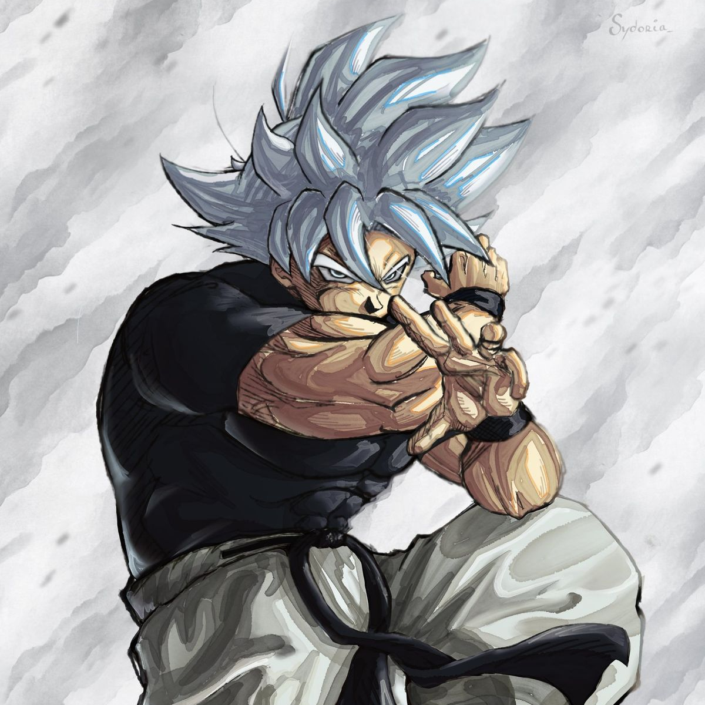

# PNG Parser
A PNG image parser with a custom DEFLATE decoder, built from scratch with no external dependencies.

## Why
Built as a deep dive into image formats and compression — every line is written from spec, 
no third party libraries. The goal was complete understanding of the full PNG pipeline.

## Features
- Full PNG chunk parsing
- Custom DEFLATE decompression (Huffman coding, LZ77)
- Support for multiple color types (grayscale, RGB, RGBA)
- Channel conversions
- Static and non-compressed Huffman blocks
- BMP parser

## Limitations
- No 16-bit PNG support
- No Adam7 interlacing
- No indexed PNGs

## Usage
```cpp
uint8_t* buffer = openImage(imageUrl, *width, *height, *channel, outputChannel, flip)
```
- `imageUrl` — path to the image file
- `width` & `height` — filled with image dimensions
- `channel` — filled with the original color channel
- `outputChannel` — desired output channel, parser handles conversion
- `flip` — vertically flip the image

Returns a raw pixel buffer laid out as G, GA, RGB, or RGBA per pixel depending on `outputChannel`.

## Architecture
The initial implementation used Huffman trees, which required pointer chasing per bit — 
cache unfriendly and slow at ~40ms for DEFLATE alone. The current version uses a two-level 
10+5 bit LUT architecture. The 10-bit primary table covers ~90% of Huffman codes with a 
single direct lookup. The 5-bit secondary table handles longer codes. The result is 
branchless, cache-friendly decoding at a fraction of the cost.

## Performance
Benchmarked on a 1200x1200 PNG (`goku.png`), Apple M3, clang -O3:
- Full decode pipeline: ~22ms
- DEFLATE only: ~12.5ms


